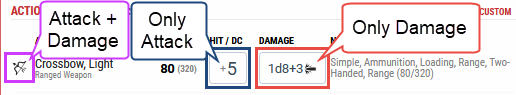

# Frequently Asked Questions

First of all, make sure you have the latest version of Beyond20 since some issues might have been recently fixed.

You can also check out the [changelog](Changelog) for recent fixes or additions to the extension.

* [How can I use Beyond20 with Foundry VTT?](#how-can-i-use-beyond20-with-foundry-vtt)
* [Can Beyond20 do '\<insert specific feature\>'?](#can-beyond20-do-insert-specific-feature)
* [Why are the Roll20 rolls sometimes displayed in a purple table instead of the nice output?](#why-are-the-roll20-rolls-sometimes-displayed-in-a-purple-table-instead-of-the-nice-output)
* [My HP from D&D Beyond doesn't synchronize to my tokens](#my-hp-from-dd-beyond-doesnt-synchronize-to-my-tokens)
* [I have a \<Class feature/Feat\> that the Features page says is supported but I don't see the option to use it](#i-have-a-class-featurefeat-that-the-features-page-says-is-supported-sharpshooter-feat-for-example-but-i-dont-see-the-option-to-use-it)
* [Why doesn't it roll to hit when I click on my weapon attack?](#why-doesnt-it-roll-to-hit-when-i-click-on-my-weapon-attack)
* [Why is Beyond20 rolling too many damage dice on Roll20?](#why-is-beyond20-rolling-too-many-damage-dice-on-roll20)
* [How can I add Bless/Guidance bonus or use Elemental Weapon?](#how-can-i-add-blessguidance-bonus-or-use-elemental-weapon)
* [How can I use this non-standard spell or feature?](#how-can-i-use-this-non-standard-spell-or-feature)
* [Why isn't the attack button appearing for my homebrew monster?](#why-isnt-the-attack-button-appearing-for-my-homebrew-monster)
* [Why can't others see my rolls properly in Foundry VTT?](#why-cant-others-see-my-rolls-properly-in-foundry-vtt)
* [How can I enable Discord integration?](#how-can-i-enable-discord-integration)
* [Why doesn't Beyond20 allow me to make a melee attack with my magic staffs?](#why-doesnt-beyond20-allow-me-to-make-a-melee-attack-with-my-magic-staffs)
* [Is auto-roll-damages broken?](#is-auto-roll-damages-broken)
* [Can you add support for rolling from \<insert favorite character sheet website\>?](#can-you-add-support-for-rolling-from-insert-favorite-character-sheet-website)
* [Can you add support for \<insert new VTT name\>?](#can-you-add-support-for-insert-new-vtt-name)

---


### How can I use Beyond20 with Foundry VTT?

You need to have your Foundry game open in the same browser as your D&D Beyond page. This means that you cannot send your rolls from D&D Beyond to the native desktop application, as that is not your Chrome or Firefox browser.
If you use the Foundry desktop application, we suggest you simply open it and leave it in the background without logging into it, then opening the invitation link (http://localhost:30000 by default) in your browser instead.

If you are using Chrome, due to restrictions imposed on extensions in the Chrome Store, you will need to manually *activate* Beyond20 for your Foundry VTT browser tab. You can do so by clicking on the Beyond20 icon in the browser's address bar from within the Foundry tab. You will need to do this everytime you load or reload the VTT page.
We recommend installing and enabling the Beyond20 companion module within your Foundry world as it will remind you to do so, and will allow other users who do not have Beyond20 installed to see your rolls properly displayed.

If you are using Firefox or if you use [The Forge](https://forge-vtt.com) for your Foundry game hosting, then activating Beyond20 in the Foundry tab is not required.


### Can Beyond20 do '\<insert specific feature\>'?

You can always check out the [Features](features) page to see if what you're looking for is supported. I would also suggest you click on the Beyond20 icon in the browser's address bar to see what options are available. The feature you want might simply be disabled.

You can also go to your browser's Extensions/Add-Ons page and open the options for Beyond20 that way. Note that the quick options popup will vary from the Roll20/Foundry VTT page to the character sheet or monster pages and some options might only be available for specific characters and not available in the full extension's options page.


### Why are the Roll20 rolls sometimes displayed in a purple table instead of the nice output?

That's because the game in Roll20 is set up to use a character sheet template other than "D&D 5e By Roll20". 

Beyond20 uses [roll templates](https://wiki.roll20.net/Roll_Templates#Using_Roll_Templates) from the Roll20 [character sheet template](https://wiki.roll20.net/Character_Sheets) to make the rolls, so if the character sheet template configured in the Roll20 game does not match the one in Beyond20, then it won't work.

To fix the issue, simply go to the [Roll20 game settings](https://wiki.roll20.net/Character_Sheets#Choosing_a_Character_Sheet) and select "D&D 5e By Roll20" for the character sheet template.

If you cannot do that (you're not the DM) or you don't wish to do it (you prefer another template), then go to the Beyond20 options and select "Other templates" in the "Character sheet templates" option. That one will use the 'default' roll template for all rolls. It won't look as nice but it will work regardless of the character sheet template you use in your Roll20 game.

### My HP from D&D Beyond doesn't synchronize to my tokens

The HP syncing needs to be enabled in your settings (see [first question](#can-beyond20-do-insert-specific-feature)) and the character name in D&D Beyond must match the character name in Roll 20 or Foundry VTT. This also applies to creatures you have in Extras, such as a Beast companion or a familiar.

#### For Roll20

Ask your GM to create a new character if you don't already have one.

In the character sheet tab, if it asks you how you want to create the character select "Edit Sheet directly". Alternatively, if you do not want to use a character sheet in Roll20, add the "hp" and "hp_temp" (these are case sensitive!) attributes to your character.

Set any value to these attributes (such as 0). A GM will need to link these attributes to your token bars by editing the token linked to the character.

The next time you update the HP on your character in D&D Beyond (or reload the character sheet), the HP should sync back to the character sheet in Roll20, and also the character's token if they are linked.

#### For Foundry VTT

The rules are similar, but slightly different. If a token you own with the same name as your character is in the currently viewed scene, then its HP will be modified, otherwise it will look for an actor with that name in your actors list. If you have multiple tokens with the same name in the scene, all of them will have their HP updated, so it is strongly recommended to not use "Wolf" as your beast companion's name, or your DM might get annoyed when you reach a scene with many wolves in it.

### I have a \<Class feature/Feat\> that the [Features](features) page says is supported (Sharpshooter Feat for example) but I don't see the option to use it

Beyond20 doesn't have access to all of your features, but it will save the list when it finds it, so if you've changed your class features (leveled up) or Feats (taken a new one) or you've just installed Beyond20 for the first time, then you need to click on the "Features & Traits" tab in the D&D Beyond character sheet to have the list displayed on the page for Beyond20 to pick it up and save it. After doing that, the option to use the feat should become available to you.

Note that character specific options are not available in the extensions' options page ("More Options") but are only visible in the quick popup settings when viewing that character sheet.

Also note that some features are always supported and don't have an option to toggle them (such as the Fighter's Improved Critical for example).

### Why doesn't it roll to hit when I click on my weapon attack?

Beyond20 only has access to the information displayed on the page. If you are in the Equipment page and are viewing a weapon item, there will not be an "To Hit" information displayed. You should instead click the Wield button and switch to the Actions tab in D&D Beyond so Beyond20 can pick up the To Hit bonus and roll for attack.

### Why is Beyond20 rolling too many damage dice on Roll20?

That's probably because you have enabled 3D dice in your Roll20 settings. The extra damage dice you see are the dice rolled in case of a critical hit, which is information that is sent to Roll20 at the same time. If you use the Roll20 character sheet and have enabled the "Auto roll damage and crits" in it, then it will behave the same.

If it's an issue, the best way to avoid it is to either disable 3D dice, or go to Beyond20 settings and disable the 'Auto roll Damage and Dice' option.

### How can I add Bless/Guidance bonus or use Elemental Weapon?

You can add custom bonuses for rolls and damages on a per-character basis, simply open the quick settings popup (the "Beyond20" button you see in the top of the character sheet, next to the character name) and under the advanced option, enter the value there.

In the case of [Bless](https://www.dndbeyond.com/spells/bless) or [Guidance](https://www.dndbeyond.com/spells/guidance) for example, you can enter in the roll bonus : `1d4`

Since v2.11.0 however, Bless spell effect is natively supported and can be toggled under the Effects options in the quick settings popup.

You can also assign a hotkey to toggle the bonus by going to "More Options" then click the "Set Hotkeys" button.

In the case of [Elemental Weapon](https://www.dndbeyond.com/spells/elemental-weapon), you can enter `+ 1` in the custom roll modifier and `1d4 + 1` in the custom damage modifier.

Be aware that the roll bonus is applied to all rolls (ability checks, skill checks, saving throws, weapon attacks, spell attacks, etc..) so if you want to have the option to use the bonus or not, you could use any of the Roll20 [Macros](https://wiki.roll20.net/Macros) or refer to the [Dice Reference](https://wiki.roll20.net/Dice_Reference) to have it be a bit more fancy.

For example, if you want it to ask you if you want to apply the Bless bonus on every roll, you could set it to : `+?{Use Bless|Yes,1d4|No,0}`

Of course, the use of such macros will only work on Roll 20, not on Foundry VTT or other.

### How can I use this non-standard spell or feature? 

If you find a feature or a spell that needs to be handled in a special way, please report it on the [issue tracker](https://github.com/kakaroto/Beyond20/issues) so I can add special support for it.

If the spell or feature or your request is particularly unique and specific to your own games, I would instead suggest you simply create a custom Action in your D&D Beyond character sheet, and you can put in the description any of the dice formulas you may need.

For example, if you are a Paladin and need to use [Divine Smite](https://www.dndbeyond.com/sources/basic-rules/classes#DivineSmite) on an Undead creature using 2nd level spell slot, you can either click on the 2d8 once and the 1d8 twice (once for 2nd level spell slot and once for undead extra damage), or you create a Custom Action and fill the description with something like this : 

```
1st level: 2d8
2nd level: 3d8
3rd level: 4d8
4th level: 5d8
Undead extra damage: 1d8
```

Then you can click on the dice formula that is relevant to you when it's time to use it.

If for example, you have access to the [Shadow Blade](https://www.dndbeyond.com/spells/shadow-blade) spell, you can create a custom action or homebrew weapon with the Finesse, Light and Thrown properties that dealds 2d8 psychic damage, and change that damage value if you cast it as a higher level spell. This way you can make a weapon attack with it.

Another example, if you want to cast [Scorching Ray](https://www.dndbeyond.com/spells/scorching-ray) at 4th level, you will see in the sidepanel it says "(3 rays)" and "Additional Rays: 2". Simply click the "Cast on Roll20" button 5 times for you to roll for the 5 ray attacks.


### Why isn't the attack button appearing for my homebrew monster?

The way that Beyond20 parses the monster stat block requires actions to be described in a specific format. The name of the action needs to be the first thing in its description and needs to be both in italic and bold.

If it doesn't work, right click on the name in the monster stat block and select "Inspect". The HTML code should look something like this : `<p><em><strong>Action Name.</strong></em>Description</p>.`

Inside of the description, you need to have either "Melee Weapon Attack:", "Ranged Weapon Attack:", "Melee Spell Attack:" or "Ranged Spell Attack:" followed by "+X to hit, reach R" or "+X to hit, range R" (where `X` is a number, and `R` is the reach or range information), you can then follow it by the target (", one creature" for example) and end with a period.

The damage information needs to follow the format: "X (D) T damage" or "X T damage" or "D T damage" where `X` is a number, `D` is a dice formula, and `T` is the damage type.

### Why can't others see my rolls properly in Foundry VTT?

Beyond20 uses CSS to properly display the rolls. If other players (or the DM using the main application window) doesn't have Beyond20 installed, the rolls won't be displayed properly. To fix that, simply ask the DM to install and enable the Beyond20 companion module into the Foundry VTT installation. That will ensure every player sees the rolls displayed properly. 

You can find the companion module [here](https://github.com/kakaroto/Beyond20/tree/master/FVTT-module/)

### How can I enable Discord integration?

Enabling Discord integration is easy and can be done in 4 simple steps : 
1. [Invite](https://beyond20.kicks-ass.org/invite) the Beyond20 bot to your server
2. Send `/secret` command in the channel of your choice
3. Set the `secret key` you received in Beyond20's options.
4. Share the `secret key` with your group.

Make sure you didn't disallow link previews and embeds as the Discord bot uses embed messages to display its rolls.

You can read the more detailed discord integration instructions, and see additional options [here](https://beyond20.here-for-more.info/discord)

### Why doesn't Beyond20 allow me to make a melee attack with my magic staffs?

Magic Staffs in D&D Beyond are considered as magical items, rather than melee weapons. Without the information that D&D Beyond would normally give, Beyond20 has no way of knowing how to attack using a magic staff, what to-hit value to use, what damages to use, etc... 

The best way to avoid this issue is to add a Quarterstaff to your equipment (don't forget to add a +1 Quarterrstaff instead if your staff does +1 damage for example). You can then customize the weapon using D&D Beyond's interface to rename the Quarterstaff to the same name as your magic staff.

As an example, you can have your Staff of Healing for healing purposes, and a Quarterstaff with the custom name "Staff of Healing(Melee)" for when you want to use it for attacks.

See [this issue](https://github.com/kakaroto/Beyond20/issues/111) for more details.

### Is auto-roll-damages broken?

No, if you are clicking the To-Hit digital dice button in D&D Beyond, it will only roll the To-Hit, as expected, if you are clicking on the Damage digital dice button, it will only roll the Damages, as expected.

If you have auto-roll-damages option enabled and want to roll both, you need to click on the attack icon itself (to the left of the action name) as it's always been before we added hooks to the digital dice buttons.



In the 2.1 release, yes, it was rolling both to-hit and damages (regardless of any setting) when you clicked on the digital dice buttons of an attack, and **that was a bug** which was fixed in the 2.2 release.

### Can you add support for rolling from &lt;insert favorite character sheet website&gt;?

No. Beyond20 is exclusively a D&D Beyond extension and I have no plans or any willingness to add support to any other website which has D&D (or other TTRPG) character sheet support.

### Can you add support for &lt;insert new VTT name&gt;?

The answer is most probably no. The issue is that there is nearly one new VTT that comes out every week, and adding support for every possible VTT is too much. Even if someone else does the job and sends it as a PR (Pull Request), it would still involve a massive amount of code review, add a lot of complexity to the overall software, and require long term maintenance as well as an increase in tech support questions relating to that VTT which we wouldn't know how to answer.

However, you do not need Beyond20 to support a specific VTT for it to work with it. Any website owner, whether for character sheets, or for a VTT, can integrate with Beyond20 and add support for it natively.

It is also possible to create an extension that bridges the gap between a specific VTT and the Beyond20 extension.

In order to support Beyond20 and integrate with it, read our [API](/api) documentation and see the examples provided.
