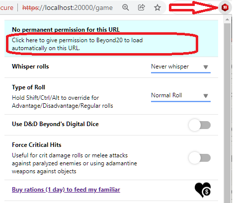
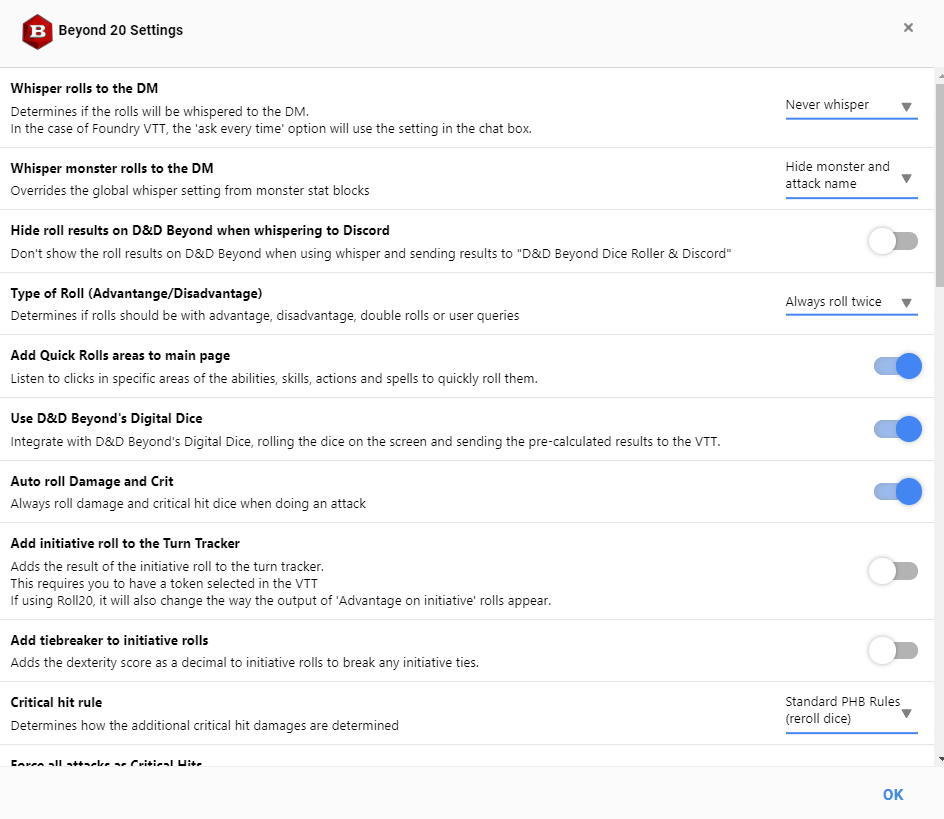
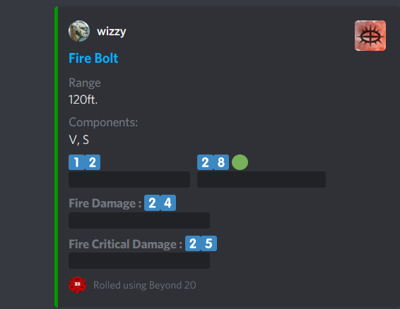
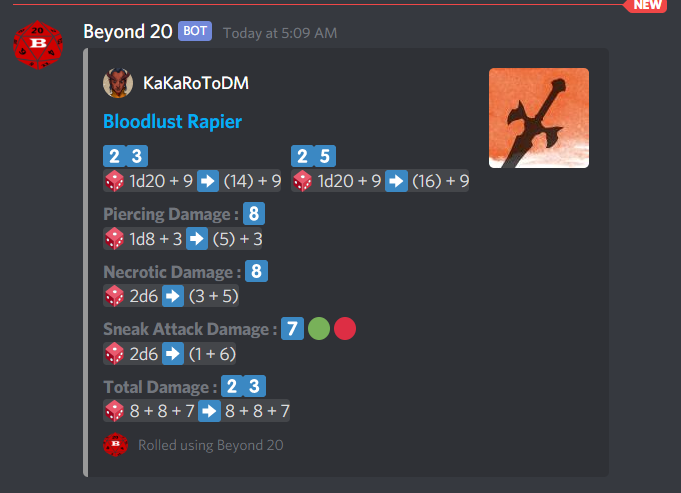

v2.8.0 (November 13th 2022)
===

Hi everyone,

It's been a long time since our last Beyond20 update, and it's a testament to how stable and 'perfect' your favorite chrome extension is! Ok, nothing is perfect 😁 but we've had very little activity in our issue tracker in recent months and things just seem to be working. I've been thinking a lot about the future of Beyond20, whether it's good as it is and to not change a working formula, or if it'd be worth it to expand our mission and add some new features that diverge from its core principle. The exciting thing about a new set of features will be a more active development again and more frequent releases. I'll let you know what gets decided.

This long-awaited release adds quite a few small quality of life features, expanding on what we have already, and fixing a few rare bugs that were discovered. Among the most pressing though is a couple of changes to how D&D Beyond website works, especially with regards to accessing a character sheet from the "My Characters" page, which has stopped working recently. We also added support to the new "Read Aloud" text in LMoP adventure, and the new statblocks used in Spelljammer.

Most of the bugfixes were for rare use cases, though some significant work went into adding Foundry V10 support, as well as dramatically improving the support for the "Native Rolls" feature in Foundry VTT (requires v10) with our most recent FVTT module update (1.5.x).

This release adds quite a few features and bugfixes, so please refer to the [Changelog](/Changelog#v280) for the full details of the changes.

One item that doesn't appear in the Changelog but which we worked on as well is the Chrome extension Manifest V3 support. One of the challenges we've had to face unfortunately is the forced upgrade by the Chrome store from Manifest V2 to their Manifest V3 for Chrome extensions. While we did the upgrade and it mostly worked, there were some issues with it that we couldn't fix reliably, and after delaying this release for too long, we decided to downgrade back to Manifest V2 for now so we don't release a version that may be unreliable to our users.
The Chrome decision to force extensions to move to their new MV3 design (by June 2023) is a very controversial one and has been a headache for many developers. We'll take the time in the next few months to ensure the upgrade is smooth and doesn't introduce any new issues in how Beyond20 functions, and we'll hopefully release MV3 support in the next release, without affecting any of our features.

As usual, thank you to all contributors, as well as to my generous [Patrons](https://patreon.com/kakaroto) and [Ko-fi/Github](/rations) supporters, who are making this possible. 

Finally, while it may be a bit too early for it, I want to wish everyone happy holidays and happy new year!
Keep rolling! 😄

2.7.0 (June 18th 2022)
===

Hi all, it's time for a Beyond20 update!

This update is being released in a bit of a rush as today, D&D Beyond made a change to the character sheets which broke the detection of the character name, breaking HP syncing among other things. 

That being said, this is not just another small bugfix release, as this release is packed with many new features, as well as many other bugfixes.

I'm super excited about one of the features that's been brewing for a very long time, and it's the ability to let users enter a custom URL to load Beyond20 on, making it send its parsed and rendered rolls to any website. While this won't be immediately useful to you, it will open the path for any VTT to implement support for Beyond20 natively, or for other smaller extensions to bridge the gap between Beyond20 and other VTTs. I can't wait to see what comes out of this feature.

Another big change is to the Roll20 combat tracker support, as it will now hide the monster names by default, to avoid spoilers, but it will also be able to match tokens to multiple monsters with the same name without the need to add the "(A)", "(B)", etc.. prefixes to every token. 

This release adds a total of 8 new features and fixes 7 issues. Please refer to the [Changelog](/Changelog#v270) for the full details of the changes.

As usual, thank you to all contributors, as well as to my generous [Patrons](https://patreon.com/kakaroto) and [Ko-fi/Github](/rations) supporters, who are making this possible. 

Happy rolling!

2.6.3 (April 12th 2022)
===

Hi everyone,

Today (April 12th), D&D Beyond updated their character sheet, which broke the parsing of the Initiative modifier. Due to that breaking change, we're releasing yet another small bugfix update to your favorite extension.

We also fixed a couple of issues that might have affected the DDB mobile app parsing of the game log when rolling from Beyond20, and added support for Foundry VTT's upcoming v10 release.

As usual, thank you to all my [Patrons](https://patreon.com/kakaroto) and [Ko-fi/Github](/rations) supporters, who are making this possible. 

Happy rolling!

2.6.2 (March 30th 2022)
===

Hi again, we're releasing another small bugfix release today for your favorite extension.

This update had to be quickly released as there were two breaking changes that happened this week, one change in the D&D Beyond character sheet which caused some issues with the character specific settings not working properly, and also a change in the Roll20 website which caused HP syncing to stop working in most situations. 

This release also adds a couple of other small but important bug fixes and features as well. See the short [Changelog](/Changelog#v262) below for more details.

As usual, thank you to all my [Patrons](https://patreon.com/kakaroto) and [Ko-fi/Github](/rations) supporters, who are making this possible. 

Happy rolling!

2.6.1 (February 21st 2022)
===

Hi everyone! It's time for another release already.

This update is a bugfix release, which we felt needed to be out sooner rather than later considering some of the bugs that popped up recently. It doesn't add much in terms of new features, but there's plenty of bugs to fix to improve everyone's games. Some of the more problematic issues we've seen reported were related to the combat tracker failing to sync properly with Roll20, duplicate prompts for Toll the Dead on Roll20, and whispered rolls not working properly on Foundry VTT. 

The big feature introduced in this update (which served to fix another bug) was the ability to roll from the digital dice boxes in monster stat blocks. So if you're on the Encounters page and looking at your monsters, you can roll with Beyond20 directly using the clickable digital dice buttons from D&D Beyond, instead of the Beyond20 icons that we added to the statblocks. This makes for a much cleaner look as well!

This release was almost entirely brought to you by [@Aeristoka](https://github.com/Aeristoka), thank you as usual for helping with Beyond20 and keeping all those pesky bugs away! If anyone wants to thank Aeristoka for his work, you can buy him a coffee on [Ko-fi](https://ko-fi.com/aeristoka)! This release has also seen the addition of a new contributor to the project, so I want to say welcome and thanks to [@jjchambl](https://github.com/jjchambl) for his contribution!

And finally, I want to thank all of my [Patrons](https://patreon.com/kakaroto) and [Ko-fi/Github](/rations) supporters, and those who reported the bugs they've found and for everyone else who helped make this release possible. Thank you all for your support and your love!

I hope this update makes your games run smoother, and happy gaming!

2.6.0 (January 4th 2022)
===

Happy New Year everyone! 🎉

I hope everyone enjoyed the holidays and got plenty of rest. We're kicking off the new year with a new Beyond 20 release, which adds a couple of interesting features, and the much anticipated support for Foundry VTT v9.

The first thing to mention is of course the support for Foundry VTT version 9, which was released only a couple of weeks ago and is looking as great as ever. Unfortunately, with the new release, Beyond20 had stopped working due to breaking API changes in Foundry, and this release fixes it and restores all functionality. We've also updated the Foundry companion module with support for chat damage buttons, allowing you to more easily apply damage or healing to your selected tokens, and also adds support for native Foundry rolls, allowing integration with other Foundry modules, such as midi-qol for example.

One big feature we've worked on is that if you are self hosting Foundry, you can now request permanent permissions for your Foundry domain allowing it to automatically be activated when you load your Foundry game. As usual, you don't need to activate Beyond20 if you use [The Forge](https://forge-vtt.com), but for all those who aren't Forge users (and missing out on its awesomeness), this is a long awaited feature. Thanks to the new permission request system, we've also removed the broad permissions from FireFox, now only requesting access to the sites we actually need, and requiring the user to manually activate Beyond20 on their Foundry self hosted URLs. If you are unfamiliar with the process, you simply need to click on the Beyond20 icon in the address bar to activate the extension for your Foundry game, and you should be able to request the permanent permission from there as well.

In other news, we've added a new "Advanced options" section, both to the per-character options and the global options, which gives us a cleaner settings interface, and will also allow us in the future to add some more controversial/rare options without worrying about bloating the UI. We also made good use of the new menu to add some new fine tuning options as well as move existing rarely used options to the Advanced menu. You can find the "Advanced Options" button at the bottom of the Beyond20 options menu.

Another small, but important feature, is that the Beyond20 changelog, which is displayed when the extension is updated, will now only be displayed when you access a D&D Beyond or VTT page. It's a very welcome change, as it used to display the changelog when the extension was updated, which could happen at any time, and could disrupt a user's browsing experience. I'd like to thank [@sleepkever](https://github.com/sleepkever) for the [suggestion](https://github.com/kakaroto/Beyond20/issues/867), because I know it was something annoying (especially last June where there were multiple consecutive updates in a short span of time), and that some users didn't want to disable the option to open the changelog either. This should make everyone happy!

That's it, as always, check out the full [Changelog](/Changelog#v260) to see all of the new features and bugfixes that went into this release.

As usual, I want to thank all of my [Patrons](https://patreon.com/kakaroto) and [ko-fi/github](/rations) supporters, and for everyone who helped make this release possible. Thank you all for your support and your love! You're the ones making Beyond20 possible!

Enjoy this update, and may 2022 bring you lots of natural 20s!

2.5.0 (September 20th 2021)
===

Hello Beyonders! We are due another major release of Beyond20 and this one packs a couple of really cool features!

The feature I'm most happy about is the new integration with the D&D Beyond Game Log. This feature was coming for a long time and was complicated to get working properly, but you will now be able to see the detailed result from Beyond20 in your Game Log and your friends/players/minions will be able to see the exact formulas and results of each roll made by Beyond20!

Another cool feature is the ability to set a target Discord channel to send rolls to, on a per-character basis. That should make it easier for people playing in multiple campaigns, not to have to switch their discord settings every time. You can now also set custom damage formulas or custom modifier formulas for your hotkeys, instead of being limited to the hardcoded choices we previously offered.

Finally, last but not least, I'm happy to announce the ability to send read aloud text from source books directly into the chat of your favorite VTT!

This is of course only a small subset of the changes, and I recommend you check out the full [Changelog](/Changelog#v250) to see all of the new features and bugfixes that went into this release.

As usual, I want to thank all of my [Patrons](https://patreon.com/kakaroto) and [ko-fi/github](/rations) supporters, and for everyone who helped make this release possible. Thank you all for your support and your love!

Enjoy this update, and keep rolling!

2.4.6 (July 7th 2021)
===

Hi everyone. We're releasing today another bugfix release to Beyond20, due to recent changes to the D&D Beyond website with the arrival of the new [Underdark mode](https://www.dndbeyond.com/forums/d-d-beyond-general/news-announcements/113373-news-underdark-mode-for-character-sheets), which caused some features to stop working correctly. This release fixes the HP syncing as well as the broken special class abilities that were affected by the recent update to D&D Beyond's site.

Another exciting change in this release is a new styling for the roll results, which will show a much cleaner look when rolling into D&D Beyond's site or to your Foundry VTT game. If using FVTT and you have the Beyond20 companion module installed, make sure to update the module too. This change was contributed by [@LorduFreeman](https://github.com/LorduFreeman) and I'm really happy with the results!

Other than these bugfixes and the new styling, there's also a bunch of new special class features added, thanks to [@Aeristoka](https://github.com/Aeristoka) as usual, who has been the main contributor to this release! You can see all the new features in the [Changelog](/Changelog#v246).

Hopefully, there won't be any new bugfixes after this (Last month's multiple releases were annoying to us both!) and the next release, in a couple of months hopefully, will bring in some new major features.

As usual, thank you everyone for your support, and a special thank you to all my [Patrons](https://patreon.com/kakaroto) and [ko-fi/github](/rations) supporters, and for everyone who helped make this possible.

Enjoy, and happy rolling!

2.4.5 (June 4th 2021)
===

And merely 30 minutes later, a 4th hotfix release because clearly I've lost touch with reality.

2.4.4 (June 4th 2021)
===

Wow, a third release of Beyond20 in as many days! Shortly after the last release, D&D Beyond released an update to the character sheets which adds support for targetted rolls in the Digital Dice roller, which broke rolling with Beyond20 when Digital Dice were enabled. This 2.4.4 hotfix release will fix the issue, along with a few other small issues.
Read on below for more information on this week's release.

2.4.3 (June 1st 2021)
===

Oups, a small (but critical) bug slipped through 2.4.2 released earlier today. This should fix it along with a couple of other small bugs discovered. See release notes below for what's new in today's releases.

2.4.2 (June 1st 2021)
===

I'm really excited about this Beyond20 update, as it adds a feature I've been wanting to add for a long time.

While this is marked as 2.4.2, which means it's a "minor" update, it's actually got some really major features, like the ability to roll from source books and classes pages, and a newly added support for roll tables (give the treasure tables in the DMG a try)!

This release also adds support for the latest Foundry VTT stable version 0.8.6 which was released today, so for those of you who have updated your Foundry to the latest release, you'll be able to use Beyond20 without problems.
If you haven't seen the latest Foundry update video (with a nice feature tour of the VTT), I recommend you check out the video on Foundry's youtube : [https://www.youtube.com/watch?v=nuyzLlk_QQQ](https://www.youtube.com/watch?v=nuyzLlk_QQQ) and of course, if you want to enhance that gaming experience even further and get the best hosting there is, with plenty of awesome features on top, you have to drop by to [The Forge](https://forge-vtt.com) and subscribe! 😄

Among other smaller bugfixes, a long standing bug that was fixed in this release is the one where dice formulas in the class features list or action snippets might get split in two and appear as two separate formulas. I finally managed to figure out a way to fix that bug, so hopefully there are no more issues there.

Overall, I'm quite happy with this release, and I suggest you check out the [Changelog](/Changelog#v242) for the full list of changes (a small/readable changelog for once).
I have recently posted a [status update](https://www.patreon.com/posts/status-update-51779621) on my Patreon that lists my current projects and plans for the short term, if anyone is curious and/or interested in giving it a read.

Thank you to all my [Patrons](https://patreon.com/kakaroto) and [ko-fi/github](/rations) supporters, and for everyone who helped make this possible.

Thank you all for using this software and for being part of this amazing community.
Enjoy, and keep rolling!

v2.4.1 (April 25th 2021)
===

Hello everyone! We're releasing a small bugfix release that polishes some of the new features introduced in 2.4.0 and fixes some newly found bugs. 
This release was also necessary due to the recent changes in Roll20 who changed the way the character sheet template is detected, causing Beyond20 to revert back to the default template. This is unfortunately the third time they changed it in recent weeks (I mentioned that in the 2.4.0 release notes) and they kept switching back and forth between the old and the new method, so I wanted it to stabilize a bit first before releasing a fix. This update supports 3 different detection methods, so hopefully, we got you covered for the foreseeable future!

There are also a few new features in this release, such as support for Raging from a Druid/Barbarian Wildshape creature, or displaying a monster's non-attack traits. I'd recommend you check out the full [Changelog](/Changelog#v241) for details. 

In other news, I'm continuing my work on bringing integrations with D&D Beyond to make life easier for my users. This time, it's in the form of a source book conversion integration with [The Forge](https://forge-vtt.com). The feature is still in beta and available as early access to my Patrons, and you can see it in action here : [https://youtu.be/DkS7w7hkg3Y](https://youtu.be/DkS7w7hkg3Y)

Speaking of patrons, another thank you goes to all my [Patrons](https://patreon.com/kakaroto) and [ko-fi/github](/rations) supporters as well as to those who contributed code to this release: Thank you all!

Enjoy, and as always, happy dice rolling!

v2.4.0 (March 30th 2021)
===

Another Beyond20 update is ready for you!
This update has been long overdue, and I can't believe that the last update was in December already. Thankfully, it seemed like Beyond20 has been particularly stable in recent months, and other than the Game Log feature, which I'm still investigating how to properly address, things have been rather smooth with only a few hotkeys related bugs.

This update fixes most of the issues with the hotkeys feature from last update, but also adds support for handling a bunch of special class features, bringing the coverage even higher in 2.4.0. The support for these special class features and spells is brought to you by `@Aeristoka`, who is, as always, on top of things! We've also got some cool new features, relating to the hotkeys handling, which has been a popular feature since its release in 2.3.0. 

One of the big changes that I've done has been to add support for doing native rolls in Foundry, which would allow the Beyond20 rolls to integrate with other Foundry VTT modules for example. This work is still unfinished unfortunately, but some of the required changes for it to function are coming as part of this release. The native rolls support will be released soon(-ish) as part of the Beyond20 Companion Module, and would not require an update to the browser extension itself.

A recent change in Roll20 has also caused Beyond20 to break a couple of days ago, where the roll templates being used had reverted back to the default template. Thankfully, this was an easy fix and is part of this release as well.

I'd like to give a special thank you to `@Aeristoka` who has been holding down the fort and doing a lot of work in recent months to keeping Beyond20 updated with new class features support, UA changes as well as general tech support, bug triaging and bugfixing.

A big thank you as usual to all my [Patrons](https://patreon.com/kakaroto) as well as those who sent their support via [ko-fi or github](/rations), and for all the love we receive from this community. And thank you for the contributors who helped make this release possible: `@Aeristoka`, `@adriangaro`, `@Stoneguard001` and `@IvanGirderboot`.

Again, shameless plug: If you're interested in trying out [Foundry VTT](https://foundryvtt.com), give it a try at [The Forge](https://forge-vtt.com/?referral=beyond20) which allows you to explore Foundry fully with a temporary license. Just sign up and and click the "[Try Foundry Now](https://www.youtube.com/watch?v=XJUIDvaqPcg)" button to get your game setup instantly, and feel free to try it as many times as you need until you fall in love with it, like the rest of us.

We've also recently launched a marketplace on the [Bazaar](https://forge-vtt.com/bazaar/?referral=beyond20) where you can find some amazing modules, maps, and assets packs for your games, and you can even download them for use in your self-hosted Foundry or Roll20 games, if you wish to do so.

Enjoy this release and happy dice rolling!

v2.3.0
===

Hi everyone!

I'm really happy with this new Beyond20 release, as I finally implemented a frequently requested and one of the most postponed features in the history of Beyond20: Custom Hotkeys!

Let's start with the boring part: Bugfixes, bugfixes and as always, more bugfixes. The most important one is the fact that last week, Roll20 changed something in the way their website works and it broke the detection of the OGL sheet, causing the rolls to use the default sheet template (the purple box) which isn't a fan favorite. This is now, of course, fixed. Also worth noting, is the improved and more stable support for Astral Tabletop by `@adriangaro`.

The new feature that got me the most excited about though is the new hotkeys manager. You can now go to Beyond20's options and configure custom hotkeys for anything you may want. Other than the usual Shift/Ctrl/Alt to do rolls with advantage/disadvantage/normal, you can now set a hotkey for enabling or disabling whispers, for using your versatile weapons one-handed or two-handed, for adding custom dice to your rolls, or to toggle any of your character specific features!

A couple of other features that I'm happy to finally see added is the support to send to the VTT custom rolls from D&D Beyond's Digital Dice roller, as well as the ability to roll weapon attacks with spells that add damages to it (such as Greenflame Blade and Booming Blade).

As always, `@Aeristoka` has been hard at work implementing support for all the new special class features and feats from the D&D rule books, and we now support all the new content from Tasha's Cauldron of Everything as well.

Thanks to everyone who submitted bug reports, who suggested feature requests, those who contributed to the project with their own pull requests (`@Aeristoka`, `@adriangaro`, `@rispig`, `@flangelier` and `@Kvalyr`) as well as those who answer questions and offer tech support to others in our [Discord server](https://discord.gg/ZAasSVS).

A big thank you as well to all my [Patrons](https://patreon.com/kakaroto) as well as those who sent their support via [ko-fi or github](/rations), and for all the encouragement I received over the past few months. You keep motivating me to continue supporting this amazing software that I love, despite my perpetually full schedule.

For anyone who was interested in trying out [Foundry VTT](https://foundryvtt.com), but you've been put off by the initial license purchase requirement, one of the recent features I added to [The Forge](https://forge-vtt.com/?referral=beyond20) is the ability to try out and explore Foundry and all of its features before buying it, so head over to The Forge, and click the "[Try Foundry Now](https://www.youtube.com/watch?v=XJUIDvaqPcg)" button to give it a try with a temporary license so you can see how amazing Foundry is, before you buy it. Then when you do, I'd appreciate it if you also used [The Forge](https://forge-vtt.com/?referral=beyond20) for your hosting services :)

Enjoy this release, and happy dice rolling!

v2.2.1
===

Apologies for this update coming one day after v2.2, but there were some critical issues that were affecting a large number of users and I had to make this bugfix release available as soon as possible. I apparently rolled a natural 1 on my perception check and bugs sneaked past me! If you're just tuning in, ignore me and go read the v2.2 release notes directly :)

This small bugfix release fixes a critical bug that made rolls not work on Roll20 anymore for those not using the OGL sheet, as well as a few issues that had to do with the "auto roll damages" option and rolling to-hit and damages separately. You'll find more details on the v2.2.1 changelog.

v2.2
===

Hi again, it's time to drop another massive Beyond20 update!

This update has been brewing for a while, and every day for the last month, I thought I'd finally be ready to release it, but there was always something taking up my time, or some new issue that needed to be fixed first. I felt bad, because I thought this overdue update wasn't going to amount to much, as I've been too busy spending most of my time working on [The Forge](https://forge-vtt.com/?referral=beyond20), but it turns out I was wrong, and this update is **massive**. It has 73 items in its changelog, over 30% more than the previous 2.0 release, making it the biggest release yet! It's hard to believe it!

Enough chit chat, let's get down to business. This release has a lot of bugfixes, taking care of all the small issues that you may have had, as well as a bunch of quality of life improvements all over the place, I'll let you discover it all through the [Changelog](/Changelog#v22). There are a couple of big features coming in this update, most notably, the support for [Astral Tabletop](https://www.astraltabletop.com) which was contributed by [@adriangaro](https://github.com/adriangaro), who did an amazing job with it. We also now have a much better integration with the D&D Beyond digital dice, as you can finally roll attack and damages separately, as well as see the nice OGL sheet template output on Roll20.

Another useful new feature is that when you first open your character sheet, or when you level up, Beyond20 will remind you to go the `Features & Traits` page of your sheet to update the information it has about the character. There's also support added for quite a few special class features (courtesy of [@Aeristoka](https://github.com/Aeristoka)) and the ability to set a custom message to be sent along specific attacks (to run macros when casting a specific spell or display an image when using your weapon for example), thanks to [@John-Paul-R](https://github.com/John-Paul-R).

As you have noticed, there are quite a few contributors who have helped make this release possible, so I'd like to thank them for their code contributions, as well as thank those who have been helping out/answering questions in our [Discord server](https://discord.gg/ZAasSVS). Finally, a big thank you as well to all of you who have sent me [rations](https://ko-fi.com/kakaroto) or who support me via [Patreon](https://patreon.com/kakaroto). You are the ones motivating me to keep on improving this beautiful piece of software!

If you find Beyond20 useful and it helps you run your games more smoothly, please consider [supporting](/rations) me and Beyond20. Alternatively, I'd invite you all to check out [The Forge](https://forge-vtt.com/?referral=beyond20), my hosting service for Foundry VTT which makes it super easy to get started playing on the best Virtual Tabletop that exists.

Thank you, and, as usual, happy rolling!

v2.1.1
===

Hey everyone! Here's another small bugfix release of Beyond20. It's only been a few days since the 2.1 release, but I introduced some rather critical bugs in the last release (that's what happens when you add "one last fix before I release" at 6AM which ends up breaking other stuff instead).

This update fixes some issues with the attack rolls being sent properly for some spells and weapons, as well as initiative rolls being sent twice. There's also a nice new experimental feature that was added by [@shadow7412](https://github.com/shadow7412) which adds synchronization of the Combat Tracker with Roll20 (no support yet for Foundry).

If you've just been updated to 2.1.1 directly, please refer to the release notes and changelog of the 2.1 release below from a couple of days ago for more information about this update.

Thanks!

v2.1
===

Another month, another Beyond20 release.
This time, it's mostly a bugfix release, and while I wanted to release this earlier—considering the number of bugs that crept into the v2.0 update—I found myself lacking the time and energy to do much work on Beyond20. Thankfully, there weren't too many bad bugs in v2.0, nothing game breaking at least, so I allowed myself to concentrate on other works and to actually take some time off and finally rest for the first time in months (yeay!). Most of the initial bugs were fixed by Aeristoka who has been contributing a large number of features and bugfixes lately, so everybody send some thanks his way!

Today unfortunately, D&D Beyond have [updated](https://www.dndbeyond.com/changelog/844-character-sheet-changelog-july-7th-updates) the character sheet and it broke Beyond20 pretty much instantly for everybody. This has forced me to rush out this release to you all, but I didn't want it to be an underwhelming release with just a few fixes, so I spent the afternoon and all night working on trying to cram as much features and bugfixes into this release. I still managed to do about half (23 out of 51) of the originally planned features/fixes for 2.1, so I'm pretty happy with that.

That's about it, a short release notes this time, the main changes here are bugfixes, especially for the break from the July 7th update of D&D Beyond, and a few general improvements to the user experience. There's still plenty of changes to read about in the [Changelog](/Changelog#v21).

Finally, as usual, a big thank you to all who have sent me [rations](https://ko-fi.com/kakaroto) or who support me via [Patreon](https://patreon.com/kakaroto).

If you find Beyond20 useful and it helps you run your games more smoothly, please consider [supporting](/rations) me and Beyond20.

Thank you, stay safe, and, as usual, happy rolling!

v2.0
===

Hi and welcome to the Two-Point-Oh release of Beyond20!

This is yet another major release version of Beyond20. I have decided to make the jump directly to the 2.0 version because of just how massive this release is and the amount of work that went into it. One of the big changes and which took the most time was a near rewrite of the entire extension into pure Javascript, making the move from the python-like Rapydscript language that I used previously. The change makes Beyond20 generally better, easier to work with and maintain long term.

I usually say this at the end, but this time, I want to start by giving a very special thank you to all my [patrons](https://www.patreon.com/kakaroto) and all the generous people who supported my work by sending rations through [Ko-fi](https://ko-fi.com/kakaroto) or other means. Without you, I wouldn't have had the courage and motivation to spend this much time working on making this release, especially with how busy and chaotic my life has been in the last few months.

As some of you may already know, I've worked relentlessly in the past few months on my new D&D related project and new business venture, [The Forge](https://forge-vtt.com), which is a hosting service for [Foundry VTT](https://foundryvtt.com) games. With Foundry VTT officially releasing just last week (on May 22nd) and me doing my best to [release The Forge](https://www.patreon.com/posts/release-party-37398469) on the same date, it has been a very stressful and chaotic time, but the launch went smoothly and I'm very happy with the results so far. I have still managed to take the time every few days and dedicate myself to working on Beyond20, and that has paid off greatly with this release being ready so soon and being so extensive.

Another big and important thing to mention relating to this release is the number of external contributions that were received, making Beyond20 greater than one man's work. Some of the contributions were small, others were large, and others were non quantifiable. We now have new amazing artwork, made by [Jerry Escandon](https://github.com/Jerryescandon) that makes the Beyond20 icons look beautiful and sleek and much nicer at the low resolutions needed by Beyond20. We've also had code contributions by [@Brunhine](https://github.com/Brunhine), [@spisin](https://github.com/spisin), [@kbuzsaki](https://github.com/kbuzsaki), [@Ainias](https://github.com/Ainias) and last but not least [@Aeristoka](https://github.com/Aeristoka). Aeristoka has also been a huge help in systematically testing every feature of Beyond20 after the rewrite of the extension and reporting all the bugs he could find as well as fixing many of them himself. What this means is that if you find a bug, you can now blame Aeristoka, not me!🤣

I know that some of you may have wanted to see this release appear sooner, especially with the D&D Beyond Digital Dice release that affected our Quick Rolls feature, but let me give you a little bit of perspective before diving into the new features in this release.

So far in nearly one year, up to the 1.1 release last month, 173 issues (bugs and feature requests) were opened on the issue tracker with most of them being closed over that same period of time. In the last 8 weeks alone, we've had 152 new issues created and closed. Here's a little table (for those who like statistics) showing how many changes (according to the github commit log history) each version had and how long it took to prepare that release.

| Release | Code changes | Development time |
|---------|--------------|------------------|
| 0.8     | 30 commits   |  17 days         |
| 0.9     | 37 commits   |  69 days         |
| 1.0     | 37 commits   |  32 days         |
| 1.1     | 24 commits   |  24 days         |
| 2.0     | 165 commits  |  53 days         |

Oh and by the way, Beyond20 now has over 135 000 users which is just incredible! 🥳

Now let's get down to the interesting bits. What does this release bring you?

You should definitely check out the full [Changelog](/Changelog#v20) to see all of the new features and bugfixes that this release brings. I personally think the most important new feature is the rewrite to Javascript, but none of you will care about that, so you'll probably be most excited about the integration with D&D Beyond's amazing new Digital Dice feature. You can now do all your rolls using the dice from D&D Beyond, and have it roll all your To Hit and Damage dice and send all of the results to your VTT of choice.

The other big change, is with regards to Discord Integration. I promised you last time, that I would enhance the features of the Discord integration, and I did. It is still not as complete as I would hope, but it should hold you over until the next round of features are added. You can now add multiple Discord destination channels to Beyond20 and choose where you want the rolls to go. You can also give a friendly name to the channel so you don't need to remember which secret key goes to which channel. I have also added support for specifying a channel dedicated to whispers when creating your secret key, as well as specifying options, the only one available now being the ability to disable the spoiler tags for the roll formulas. See the updated instructions on the [Discord](/discord) page for more information.

Another change that I am very happy about is the automatic detection of the character sheet template used on Roll20. We've had so many people asking about "why does Beyond20 send an empty message" and us having to point them to the [FAQ](/faq) that I've had to tackle that issue and make Beyond20 smarter. Now if your game is not using the 'D&D 5e By Roll20' character sheet template, then it will automatically use the default template instead. This also applies when using pre-rendered rolls when you roll using the Digital Dice.

Finally, I'd like to reiterate my thank you to all who have sent me rations/coffees through the [Ko-fi](https://ko-fi.com/kakaroto) link or who pledged on [Patreon](https://patreon.com/kakaroto).

If you find Beyond20 useful to you and it helps you run your games more smoothly, please consider [supporting](/rations) me and Beyond20.

Thank you, stay safe, and, as usual, happy rolling!

v1.1
===

Hey everyone, it's time for a new Beyond20 release!

That's a lie, it's actually not time for the release, but D&D Beyond has been updating their character sheet layout recently and Beyond20 was therefore broken for some users who were selected by D&D Beyond for beta testing the new layout.

This means that I'm making a release earlier than expected, which unfortunately also means that it doesn't have all of the new features I had planned for v1.1. The big change in this update is of course the fact that it will now also work for those using the **new D&D Beyond sheet layout**. The change might not be visible to most of you, but there were some internal changes to the website that required Beyond20 to parse the page differently.

While there's also a couple of bugfixes in this update (as usual, refer to the [Changelog](Changelog#v11) for the full details), there are also two interesting features that were added :
- You can use in custom spell/action/weapon descriptions the formula `1d20 + your spell save DC` or `+ your Wizard spell attack` or `+ your Cleric spell modifier`, etc... to have those parsed and add the proper modifiers. These special formulas join the other `+ your dexterity modifier`, `+ your Paladin level`, `+ your proficiency bonus` and `+ your AC` that were already supported.
- You can now define the damage type for your custom damage dice in the character sheet's beyond20 quick settings. To specify the damage type, simply prefix your formula with the type separated with a colon, for example `Rage: 2` or `Fury of the small: 3, Magic Weapon: 1`

The Discord integration functionality turned out to be much more popular than I initially thought it would be, and I was hoping to add some new cool features to it, but due to the urgency of this release, that's delayed. I will work on getting it more fleshed out for next time though, I promise.

I'd also like to take a moment to quickly address the current global crisis. Due to COVID-19, there are many people who have been forced to move their D&D games to online play, and this can be seen by the sudden surge in popularity of the Beyond20 extension. It is a bittersweet feeling, since, while I am deeply saddened by what's happening outside our homes, I am also proud to have been able to help people stay connected and ease their experience in how they play their favorite game online.
When I made the last release, I had announced that I'd achieved, ten months after the initial release, a total of 15 226 chrome and 1 611 Firefox users (on March 16th), and today, three weeks later (on April 8th), Beyond20 now has 58 292 chrome and 5 665 Firefox users. That's almost 4 times the users in just 3 weeks, and it's all been because of you, isolating yourselves and instead of spreading the virus, you were spreading through word of mouth, how much you love my extension and find it helpful.

I like to end these release notes with my usual thank yous. First, I'd like to thank the D&D Beyond team who have reached out to me and have granted me access to the alpha character sheet in advance so I could update Beyond20 to work with the new layout. Working with them has been a real pleasure, and I wanted to thank them for being so friendly and open.

I'd also like to thank all of you who have sent me rations/coffees through the [Ko-fi](https://ko-fi.com/kakaroto) link or who pledged on [Patreon](https://patreon.com/kakaroto) through my [support](/support) page. The outpouring of love and support has been tremendous and is what keeps me working and updating Beyond20 for you all. 

Thank you as well for all of you who told others of the extension or who came to my [Discord](https://discord.gg/ZAasSVS) to thank me or to tell me how much you loved my work.

If you find Beyond20 useful to you and it helps you run your games more smoothly, please consider [supporting](/rations) me and Beyond20.

Thank you, stay safe, and, as usual, happy rolling!

v1.0
===

Wow, it's the Vee-One Release! 

Alright, the v1.0 version doesn't hold any particularly special importance. I started releasing Beyond20 ten months ago with v0.1 and this is the 10th release since then. This release is still a pretty major milestone as I'm releasing a new feature in Beyond20 that I'm sure many of you will love. I didn't know if I would be able to do it, but it turned out to be easier than expected, and I present to you : [**Discord Integration**](https://beyond20.here-for-more.info/discord)

You can now invite the Beyond20 Discord bot into your servers and have all your rolls sent to Discord. Be aware that you can either send to Roll20 or to Discord, not both at the same time. Since that limitation is not there for Foundry VTT, I'll try to find a way to achieve the same thing with Roll20, though I'm not sure if it would be possible.

Here's what it looks like (with and without the spoiler tags revealed, click to zoom) : 

[{:width="300px"}](images/screenshots/discord-hidden.png) ---  [{:width="300px"}](images/screenshots/discord-rolls.png)

One other thing of note in this release is that I've received my first external code contribution. Thank you Jeremy '[@jaypoulz](https://github.com/jaypoulz)' Poulin who implemented the option to add the dexterity modifier as tie breaker to initiative rolls. 

This release also fixes (for the third time) the changes to D&D Beyond's Encounters page, allowing you, once again, to roll from the stat blocks of monsters directly in the Encounters or the new Combat tracker.

There's plenty more features and a whole lot of bugfixes that made their way into this release and, as usual, you can read the full [Changelog](Changelog#v10) below. I wanted to do so much more, but saying that I've been busy for the past 2 months would be the understatement of the year, so I had to bump some of those features for the next release, but hopefully the Discord integration makes many of you happy and makes up for any feature you may have been waiting for.

I expect v1.1 to be ready in a month or two, to keep up with my usual release schedule, but I'm dedicating most of my time right now to a new business project I've started for hosting Foundry VTT games, so things may be a bit slower than usual in the coming months. With my new business, [The Forge](https://forgevtt.com), my aim is basically to have a user experience resembling Roll 20 when it comes to game and user management but with the powerful Foundry VTT as the core technology behind it. And of course, I'm doing my best to make it as stable, polished and user-friendly as I've tried to do with Beyond20. Check it out if you're curious, but do note that it's currently still in beta and I'm not taking subscriptions just yet other than offering beta access for my patrons.

As usual, I can't end without saying a big thank you to all those who supported this project and who contributed in one way or another. A big thank you to my patrons of course, who are making this possible, and to the 15226 chrome users and 1611 Firefox users (as of today, March 16th) of the extension who are using it, sharing it with their groups and friends, and who write reviews and send me praise/encouragement every day. Thank you all!

If you find Beyond20 useful to you and it helps you in your games, please consider supporting me, either on [Patreon](https://patreon.com/kakaroto), [Github](https://github.com/sponsors/kakaroto) or [Ko-fi](https://ko-fi.com/kakaroto).

Thank you, and happy rolling!

v0.9
===

It's time for the v0.9 release of your favorite extension! This adds support for a lot of special feats and class features, thanks to @Kelijyr on [Discord](https://discord.gg/ZAasSVS) who tracked down most of them. I've fixed the bugs that have been reported recently, and added some cool new features as well. My favorite is the ability to quickly roll with advantage by holding Shift when clicking the roll button. You can also roll with disadvantage by holding Ctrl, or do a normal roll by holding Alt. Thanks to @TheSheep from [Github](https://github.com/kakaroto/Beyond20/issues/81) for the suggestion and proof of concept.

Another cool feature, is the syncing of Temp HP for your characters and the HP and Temp HP for your Extra creatures. Make sure you rename that "Wolf" Beast Companion that follows you into a unique name to avoid changing the HP of all the wolves attacking you in your next battle. And one final thing which took way too long to achieve was the addition of the quick settings button for Firefox users. I originally thought it was a Firefox bug but I finally realized that Chrome was not following the specification and I had to work around it to achieve what I was trying to do. But now it works, so that's great.

As usual, big thanks to everyone who helped, supported me, reported bugs, gave feature suggestions, or just spread the word about this extension to their friends and gaming groups. A special thank you as always to [my Patrons](https://patreon.com/kakaroto) who keep me motivated.

I have also recently joined the [Github Sponsors](https://github.com/sponsors/kakaroto) program, and for the first year, Github is matching contributions up to 5000$ per developer, so [check it out!](https://github.com/sponsors/kakaroto)

If you find Beyond20 useful to you and it helps you in your games, please consider supporting me, either on [Patreon](https://patreon.com/kakaroto), [Github](https://github.com/sponsors/kakaroto) or [Ko-fi](https://ko-fi.com/kakaroto).

Thank you, and happy rolling!

v0.8
===

Another update already! This was meant to be a small bugfix release, but I still managed to add nice set of new features as well. The one I'm most happy about is the Quick Rolls feature which lets you roll ability checks, actions/weapons/spells directly from the main page without having to open the side panel first then click on the beyond20 icon. I am most happy about the fact that I managed to do this without adding tons of new dice icons everywhere in the character sheet. All you need to do is click on the ability/save/skill modifier or the icon next to the attack (or the small 'Cast' button next to spells) to have the Quick Roll happen. Conveniently, a Beyond20 icon will appear as a tooltip above the areas that are considered quick rolls to make them recognizable. You can still click anywhere else (where the tooltip doesn't appear) to open the side panel normally without auto-rolling. The option can also be disabled of course in case you don't like it, but I expect this will be a fan favorite!

I have also added support for super advantage and super disadvantage rolls (and roll thrice for FVTT users or those using the Dice roller). That was a compromise in trying to add support for the Elven Accuracy feat which was very difficult to get right. Note that on Roll20, if you use the 'D&D 5e by Roll20' character sheet template, there is no way of rolling a third dice, so 'roll thrice' acts as a 'roll twice', but the 'super advantage/super disadvantage' modes will work just fine as it will actually roll 3 dice even though only two are shown, the second roll box will be an advantaged/disadvantaged roll. You can hover on that box to see all the dice results.

Last major feature that was added is the condition tracking for the character sheets. If using FVTT and you have the Beyond20 FVTT module (which you should), then update the module as it will allow you to automatically set condition status effects on the tokens. For Roll20 unfortunately, I never understood any of their status effect icons and I didn't want to choose some as representing specific D&D conditions as I expect everyone has their own interpretation of each icon's meaning.

Finally, I've fixed a bunch of bugs from the last release, and added support for a new Paladin class feature and handling for three special spells. As usual, I suggest you check out the full [Changelog](Changelog#v08) for more details.

Also, as usual, I'll thank everyone who helped, supported this project, reported bugs or gave feature suggestions, or just spread the word about this extension to their friends and gaming groups. A special thank you as always to [my Patrons](https://patreon.com/kakaroto) who are always motivating me to keep doing what I love!

Happy Rolling!

v0.7
===

The #ThankYouPatrons release!

This release is dedicated to my generous [patrons](https://patreon.com/kakaroto) who are making this possible by supporting my projects. Today (November 19th) is the [#ThankYouPatrons event](https://www.thankyoupatrons.com) organized by Patreon. As I asked recently my patrons which projects they would like me to focus on, I was surprised to see Beyond 20 at the top of the poll results, so I've worked day and night to making this release possible for today in order to celeberate all those who have generously given me their support.

As a way of thanking them for their support, I've made this a big release with some major improvements and new features. The most important of which is the addition of a new Dice Roller for anyone using D&D Beyond without a Virtual TableTop (or using one that isn't supported by Beyond20).

I have also added a new option for how critical hit dice are calculated so you can select some of the more used homebrew rules instead of the D&D 5e PHB rules. I unfortunately could not add a 'double dice result' option even if I know it's a popular one, because the way Roll20 does its rolls makes it impossible. 

I've also added Beyond 20 button for quickly accessing the settings in both the VTT and the D&D Beyond pages. I've realized that many users never noticed that they can click on the Beyond20 icon in the toolbar to get character specific options, so I hope this makes it much more visible to everyone and makes it easier to access and use as well.

The new support for many of the special class features is another important change : You can now enable through the quick settings menu the following features : Bloodhunter's Crimson Rite, Ranger's Dread Ambusher, Paladin's Legendary Strike, Warlock's Hexblade's Curse and the Rogue's Assassinate.

There are many other smaller improvements or bugfixes, and I invite you to check out the full [Changelog](Changelog#v07) for more details.

Thank you to everyone who submitted their feature requests or reported bugs they found, please continue to do so and I'll be happy to tackle those as soon as possible.

And finally, again and always, a special thank you to [my Patrons](https://patreon.com/kakaroto) who are making this possible and for everything they've done for me!

Happy rolling!

v0.6
===

Another month, another Beyond20 update! I won't bore you with long release notes this time. This adds a couple of features that were requested on the github [issue tracker](https://github.com/kakaroto/Beyond20/issues) and fixes some bugs as well. I am mostly just responding to requests at this point so if there's something you'd like the extension to do, let me know and I'll work on it.

The two main feature of this release are the ability to display spell cards from monster stat blocks directly without having to open the spell page separately, and better support for Vehicles. With the `Baldur's Gate: Descent into Avernus` release, we now have some new types of Vehicle stat blocks for Infernal Machines and Beyond20 parses those and allows you to roll them. I've also improved the regular monster stat block parsing to let you roll monster features and legendary actions.

There are other features and bugfixes as well, so I recommend checking out the [Changelog](Changelog) for the full list.

A big milestone this week is that Beyond20 has now reached 5000 active Chrome users (according to Chrome Web Store statistics) and nearly 450 installs on Firefox. Since I don't really promote Beyond20, this has mostly happened thanks to word of mouth and thanks to the great reviews people have been giving this extension. Thank you everyone for sharing and talking about it and thank you for all the love and words of appreciation I'm receiving from the community, it really means a lot! I'd also like to thank those who reported the bugs or gave the ideas for the features that were added in this release!

And finally, again and always, a special thank you for all those who donated as well as to my [Patrons](https://patreon.com/kakaroto) who have paid for the development of this update.

v0.5
===

Another small update but one that is long overdue, also there's a lot to talk about.  
As Beyond20's feature list has stabilized and it does most of what I want it to do, I haven't been working on it as much as I was before (until/unless people request features on [Github](https://github.com/kakaroto/Beyond20/issues) which I'm happy to handle). This update fixes the bug where spell pages weren't working anymore, it adds a few new features which you can read about in the [Changelog](Changelog), but the one major change is one that will affect FVTT users on Chrome.

Starting from v0.5, if you are using FVTT on Chrome (Firefox users are unaffected), you will need to click on the Beyond20 icon in the toolbar to 'activate' Beyond20 on your FVTT tab. The reason for this change is that, since FVTT can be hosted anywhere, I had to have very broad persmissions for Beyond20, basically giving it access to every website, and it doesn't seem like Google likes that very much so every update has been stuck for 7 to 10 days while a Google employee reviews it to make sure it doesn't do anything malicious. The Google Chrome Web Store will also add a new policy, effective October 15th 2019 to restrict extensions that use broad permissions and Beyond20 might be taken down unless I make this change.  
By not having access to every website, Beyond20 cannot verify if the current page is an FVTT installation, so Beyond20 will not work by default on FVTT. The solution however is to click on the Beyond20 icon in the toolbar which is your way of telling Chrome that you give the extension permission to access the current page. That will activate Beyond20 for the FVTT page and then it will work just as it did before! I've also updated the FVTT companion module so it shows an information banner reminding you to activate it when you first load the page.

Other than that, most of my work in the last month has been concentrated on making modules for FVTT. I've completely finished my transition away from Roll20 and into FVTT as my VTT of choice and I couldn't be happier. While [FVTT](http://foundryvtt.com) is still considered Beta software, I think it's much more stable than Roll20 ever was, it has also surpassed it by miles in terms of performance, features, stability, ease of use, etc.. (the only big thing missing is macro support, but with an extensive API and a modules framework, it doesn't matter to me as much), if you're curious about why I like it so much, you can read a comment I wrote about it [here](https://www.dndbeyond.com/forums/d-d-beyond-general/general-discussion/38455-beyond20-integrating-d-d-beyond-with-roll20?comment=42).

That being said, on that same forum, I've seen a few people worried that it means Beyond20 will stop supporting Roll 20 and I want to assure you that this isn't the case. While I'm not a Roll 20 user anymore, I will keep implementing all new features for both Roll 20 and FVTT and will keep maintaining the software (bugfixes) for both platforms as well. In the same way that I fix and test Beyond20 on Firefox even though I don't use Firefox personally.

Finally, a big shout out to all those who donated to me via Paypal and to my [Patron](https://patreon.com/kakaroto) subscribers who have been supporting my work in the recent months (and therefore, paid for this Beyond20 update).  
Thank you all!

v0.4
===

A small update but it took a while to do as I'm working on other things lately. I've finished the support for FVTT basically and fixed the outstanding bugs. I'll now be mostly concentrating on FVTT modules and other similar work, though Beyond20 will continue to get updates to fix any bugs found or add features as they get requested.

In other news, it's my birthday in a few days, so yeay!

v0.3
===

This is a major update that I've been working on for a while. As I'm moving away from Roll 20, I've added support for Foundry VTT which works so much better for me. In order to do that, I've had to change some of the way that Beyond20 works and move a lot of the logic out of the Roll20 module and into the D&D Beyond module.

Another consequence is that the extension now needs permission to access all websites and that's simply because Foundry VTT can be self-hosted on any website. If the extension doesn't find a FVTT instance on the page, it won't load anything. If you are worried about what it does exactly, feel free to review the source code on [Github](https://github.com/kakaroto/Beyond20).

Roll20 support will continue of course, so you don't need to worry about that, but now you can also use Beyond20 with FVTT.

A lot of my time was also spent on writing a full campaign exporter and a Roll20 -> FVTT converter which I might release at some point in the future. For now it's available in beta to my [Patreon](https://patreon.com/kakaroto) subscribers. 

There's a couple of bugfixes and some new features, but the FVTT support is the major take away from this version!