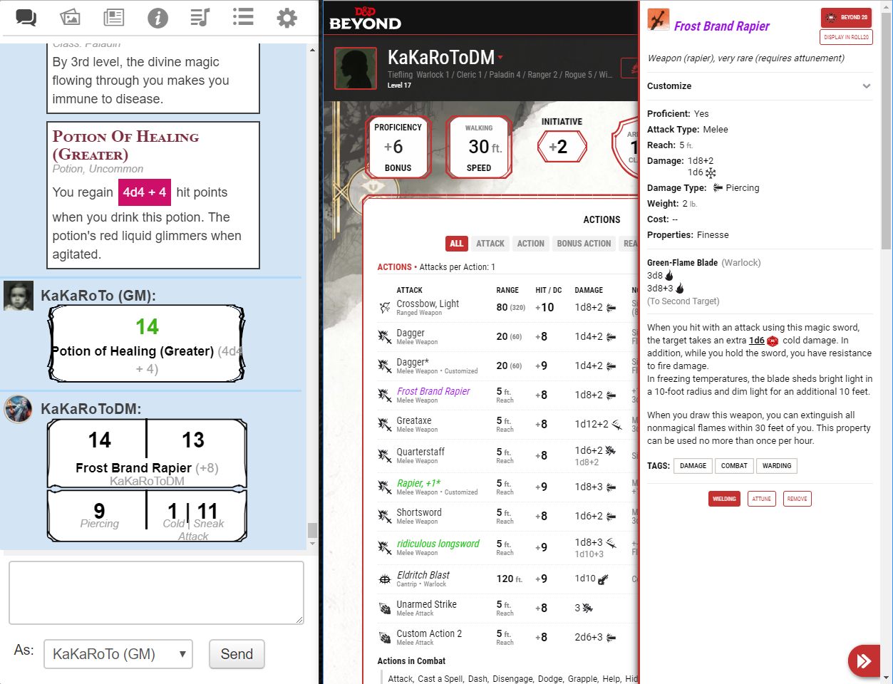
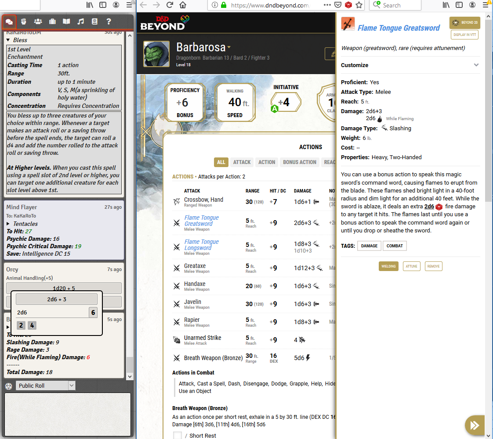
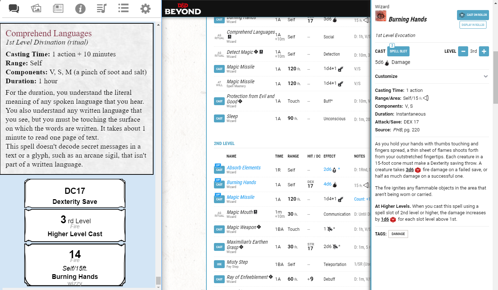
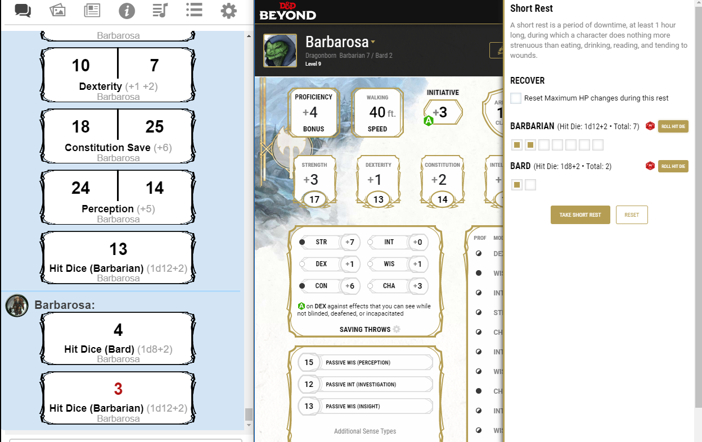
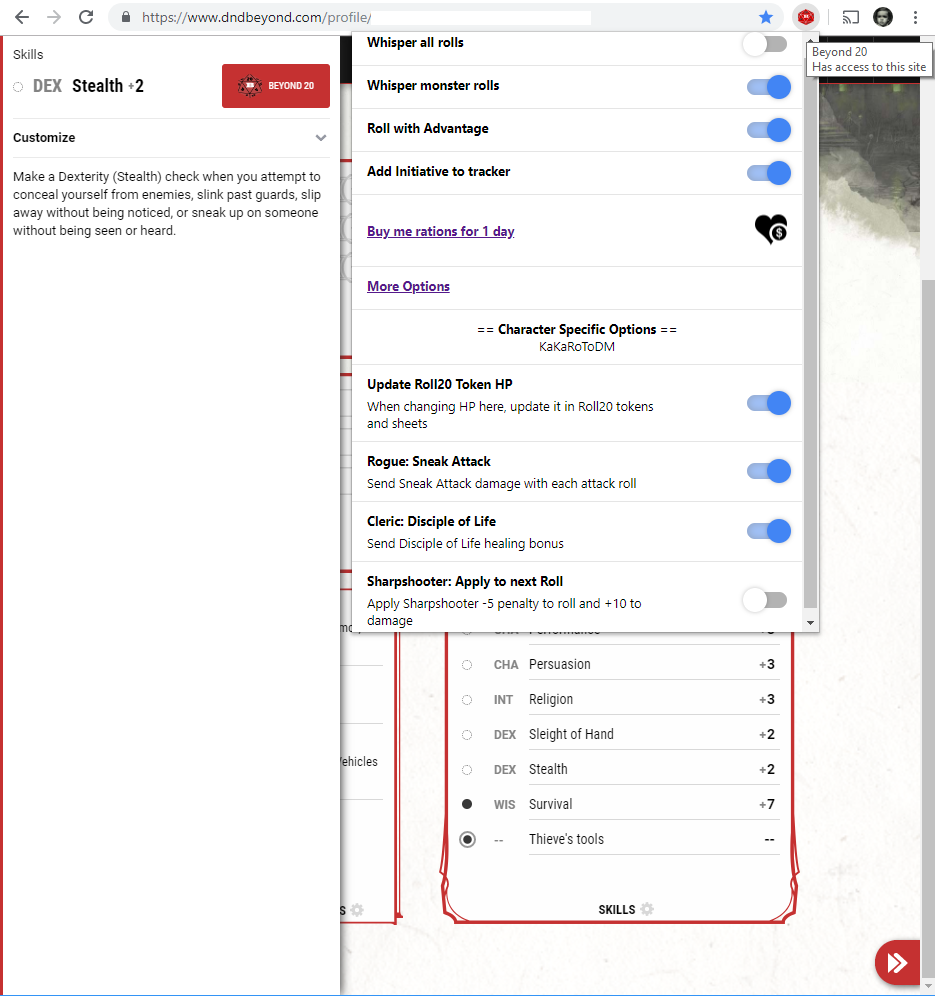
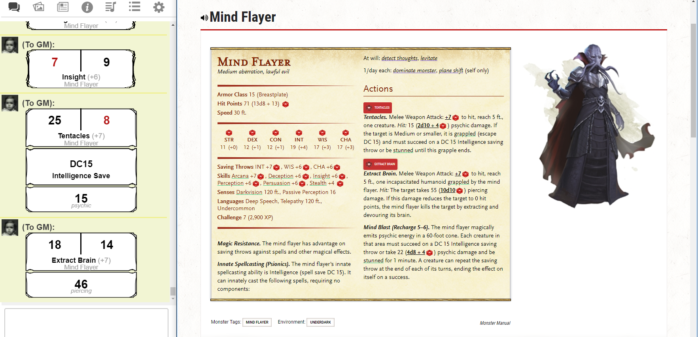
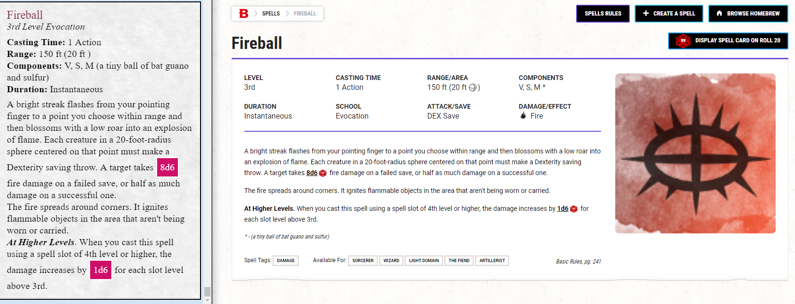

### Note: These videos and most of the images are over a year old, the extension has evolved immensely since then, but I always lack the time to update the images and videos here.
### Please keep that in mind and if anyone is willing to make new and nicer videos and/or screenshots, let me know.

I've made a [video tour](https://www.youtube.com/watch?v=QRyB7qPEyKw) of all the features of Beyond20 v0.1.

<iframe width="560" height="315" src="https://www.youtube.com/embed/QRyB7qPEyKw" frameborder="0" allow="accelerometer; autoplay; encrypted-media; gyroscope; picture-in-picture" allowfullscreen> </iframe>

If you don't have an entire 15 minutes of your life to sacrifice to my boring video, I've also done a much quicker demo of the most important features [here](https://www.youtube.com/watch?v=vHtR9hsbzP4)
<iframe width="560" height="315" src="https://www.youtube.com/embed/vHtR9hsbzP4" frameborder="0" allow="accelerometer; autoplay; encrypted-media; gyroscope; picture-in-picture" allowfullscreen></iframe>

If you don't even have 2 minutes to spend watching that, then here are some screenshots to show you just how amazing Beyond20 is (**click to zoom**):

{:height="16px"} This shows the "Beyond20" roll button and "Display in Roll20" button that get added to the side panels, as well as the Roll20 chat showing a class Feature display, an equipment item, a roll from clicking on the dice in the potion's description, and finally an attack of a multi-damage weapon.

{:height="16px"} This shows Beyond20 (v0.3) running on Firefox and sending rolls to Foundry VTT. Notice the roll details showing as a tooltip on mouse hover, spell cards and weapon descriptions are expandable/collapsable in attacks as well.

{:height="16px"} Beyond20 supports integration with D&D Beyond's Digital Dice. See it in action here!

{:height="16px"} A high level of customization lets you control exactly how your rolls are handled, and you can even set hotkeys to enable and disable specific options or character specific class features.

{:height="16px"} This shows how a spell card is displayed in Roll20 as well as an attack spell beingcast :

{:height="16px"} This shows the "Roll Hit Die" buttons in the Short rest panel, with support for multiclassing. You can also see previous rolls for ability, saving throws and skill checks.

{:height="16px"} This shows the button on the skill check panel but most importantly the popup menu with the quickly accessible options.

{:height="16px"} This shows the monster page with all the dice added to the monster stat block. An insight check was rolled as well as the two attacks of the monster

{:height="16px"} This shows the monsterspell page where dice formulas are replaced in the spell description automatically. A "Display spell card on roll20" button is also available, which displays the spell card when selected. The spell card is shown as it appears in Roll20 on the left.

{:height="16px"} This shows a roll using the Discord bot introduced in v1.0 with the dice formulas hidden behind spoiler tags. This roll had a critical hit, so the side shows as green.

{:height="16px"} This shows a roll using the Discord bot introduced in v1.0 with the dice formulas displayed after clicking on the spoiler tags.

